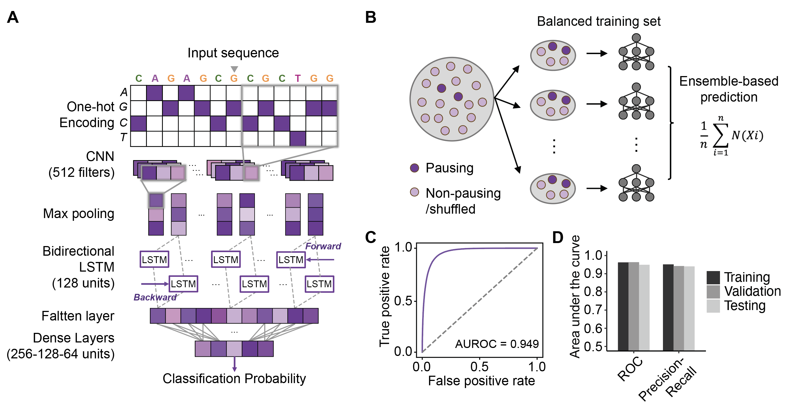

# DeepPATT

**DeepPATT** (Deep learning-based Pol II pausing And Transcription Termination model) is an explainable deep learning framework designed to predict RNA Polymerase II pausing and transcription termination dynamics from adjacent DNA sequence input.


## Model Structrue 



- Accepts one-hot encoded DNA sequences as input.
- Uses an ensemble-based deep learning models to predict Pol II pausing probability.
- Outputs per-nucleotide probabilities of RNA Polymerase II pausing at transcription termination sites.

## Getting Started


1. Clone the repository:
   ```bash
   git clone https://github.com/ShengShawnWang/deepPATT.git
   cd deepPATT
   ```

2. Download the pretrained model files from Hugging Face Hub:
   
   You can download the model files manually from:
   Termination model: https://huggingface.co/ShengShawnWang/deepPATT/tree/main/model
   
   Pormoter model: https://huggingface.co/ShengShawnWang/PausingPromoter/tree/main/model
   
   Or programmatically via Python:

   ```python
   from huggingface_hub import snapshot_download

   # Download all model files into a local folder named 'model' for termination models
   snapshot_download(repo_id="ShengShawnWang/deepPATT", repo_type="model", local_dir="./model")

   # Alternatively, for the promoter-proximal Pol II pausing prediction task, you can use:
   snapshot_download(repo_id="ShengShawnWang/PausingPromoter", repo_type="model", local_dir="./model")


4. Set up your environment:
   The model was implemented using Python 3.8.13. It is recommended to use a virtual environment to avoid dependency conflicts.
   ```bash
   python -m venv venv
   source venv/bin/activate
   pip install -r requirements.txt
   ```

5. Prepare your input data:
   - A one-hot encoded CSV file containing 401-nt window sequences centered on the nucleotide positions of interest.


6. Run the HMM training and prediction:
   ```bash
   python deepPATT.py -a ./example/X.csv -m ./path/to/model -o ./example/
   ```

This will save the predicted Pol II pausing probability in transcription termination as `prediction.csv` in the specified output directory.


## License

This project is licensed under the MIT License.


## Contact

For questions, suggestions, or issues, please open an issue on GitHub:
https://github.com/ShengShawnWang/deepPATT/issues

